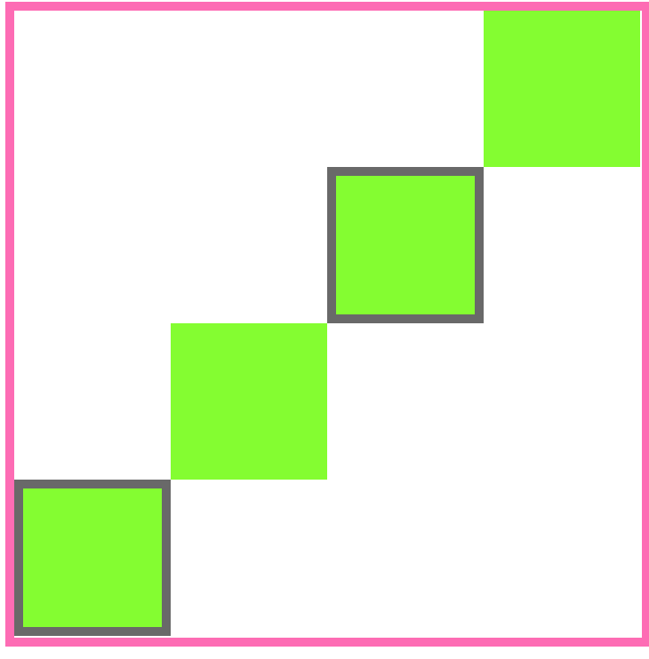

# Stairway To Heaven

Baue Treppen mit `div` Elementen und `css`!

## Aufgaben

### Aufgabe 1

- Öffne die `index.html` Datei und setze sie mit dem HTML5 Boilerplate Code auf

### Aufgabe 2

Erstelle ein Bild einer Treppe nur mit `div` Elementen und nutze das untenstehende Bild als Vorlage.

- Verwende nur HTML `div` Elemente
- Verwende die folgenden CSS Eigenschaften;
  - `width`
  - `height`
  - `background-color`
  - `margin`
  - `box-sizing`.
- Verwende kein `padding`!

### Aufgabe 3

Erstelle ein zweites Bild einer Treppe nur mit `div` Elementen und nutze das untenstehende Bild als Vorlage.

- Verwende nur HTML `div` Elemente
- Verwende die folgenden CSS Eigenschaften;
  - `width`
  - `height`
  - `background-color`
  - `padding`
  - `box-sizing`.
- Verwende kein `margin`!
